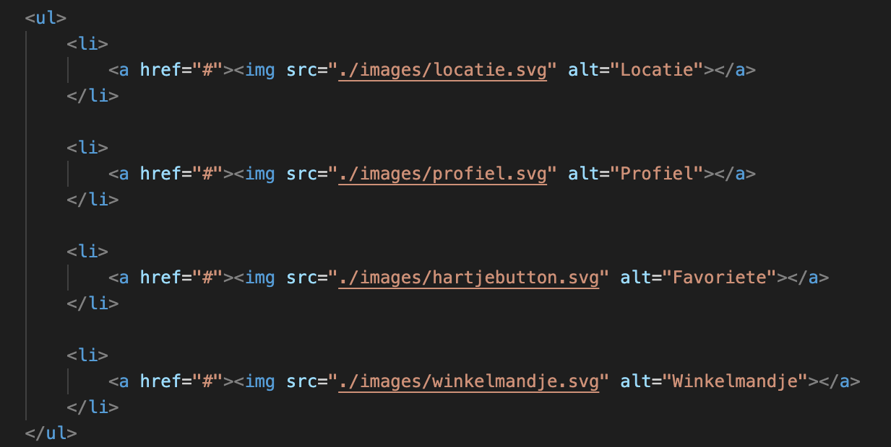

# Procesverslag
Markdown is een simpele manier om HTML te schrijven.  
Markdown cheat cheet: [Hulp bij het schrijven van Markdown](https://github.com/adam-p/markdown-here/wiki/Markdown-Cheatsheet).

Nb. De standaardstructuur en de spartaanse opmaak van de README.md zijn helemaal prima. Het gaat om de inhoud van je procesverslag. Besteedt de tijd voor pracht en praal aan je website.

Nb. Door *open* toe te voegen aan een *details* element kun je deze standaard open zetten. Fijn om dat steeds voor de relevante stuk(ken) te doen.

## Jij

  
uitwerken voor kick-off werkgroep

  ### Auteur:
  Daphne Kool

  #### Je startniveau:
  Blauw / Rood

  #### Je focus:
  Responsive
 

## Je website

  
uitwerken voor kick-off werkgroep

  ### Je opdracht:
  Van Haren: https://www.vanharen.nl/nl-nl/

  #### Screenshot(s) van de eerste pagina (small screen): 
  Van Haren, dames 
  

  #### Screenshot(s) van de tweede pagina (small screen):
  Van Haren, Oxmox Taupe Chunky Sneaker  
  
 

## Toegankelijkheidstest 1/2 (week 1)

  
uitwerken na test in 1e werkgroep

  ### Bevindingen
  Lijst met je bevindingen die in de test naar voren kwamen:
  Kleuren contrast is goed. Grote witte letters van de koppen zijn goed te zien. Echter, zijn de witte letters op oranje niet goed zicthbaar, anders om wel. Ook zijn de dunnen zwarte letters slecht te lezen bij veel omstandigheden (kleurenblind, zwart-wit en geblurd)

  #### Screenreader
  Korte omschrijving:
  De Screenreader op de site van Van Haren werkt niet erg goed. Koppen op de site die voor ziende mensen gezien worden, die als buttons op plaatjes staan, worden door de screenreader overgeslagen. 
   
  De screenreader leest vooral alle details van de producten op, en rekent deze als koppen, terwijl dit allemaal "a" is.

  #### Muis en Toetsenbord 
  Korte omschrijving:
  De muis en toetsenbord werken op de site van Van Haren prima. Wel is er weinig tot geen gebruik gemaakt van een hover waardoor de gebruiker vaak niet goed kan zien waar hij of zij op dat moment met zijn muis overheen gaat en is er de kans dat een gebruiker op een product klikt wat hij of zij niet wilde.
   

  Dit kan opgelost worden door, meer gebruik te maken van een hover die goed een afbeelding van een product naar voren laat komen, zodat de gebruiker weet dat de muis opdat moment zich op dat product bevindt.

  #### Motoriek (shocks, elastiekjes)
  Korte omschrijving:
  Met de shocks verliest de website van de Van Haren niet zijn werking. Alleen is er wel een nadeel dat je door de shocks soms onverwacht te hard drukt om je muis. Hierdoor kan je dan perongelijk een product aan klikken welke een gebruiker niet wilde zien. 

  Hoe kan het opgelost worden?
  De problemen met de shocks kunnen niet worden opgelost, omdat de het probleem eigenlijk ligt bij de shocks zelf.

  #### Visueel (brillen, contrast, kleurenblind, dark/light). 
  Korte omschrijving:
  Wat bij de kleurenblindheid veel naar voren kwam, is het probleem dat de kleine zwarte letters over de gehele pagina slecht tot bijna niet leesbaar zijn. Bij veel kleuerenblindheid neemt de kleur van het zwart af en vervaagt dit tot grijs, waardoor de letters slecht zicthbaar worden.
   

  Bij gebruikers die alleen zwart/wit zien, is er veel wit aanwezig. Elke wit is een lichtere tint, maar voor mensen die zwart wit zien is deze tint verschil niet zictbaar. Hierdoor lopen bijvoorbeeld de achtergrond en de product achtergrond in elkaar over. 
  
  
  Hoe kan het opgelost worden?
  De kleine zwarte letters zullen groter en dikker gemaakt moeten worden, om deze zo beter zichtbaar te maken.
  De verschillende tinten wit zullen moeten worden aangepast. Niet in wit tinten, maar bijvoorbeeld in grijze vlakken.

## Breakdownschets (week 1)

  
uitwerken na afloop 2e werkgroep

  ### de hele pagina: 
  

  ### dynamisch deel (Carousel): 
  

  ### wellicht nog een dynamisch deel (Navigatie menu): 
  

## Voortgang 1 (week 2)

  
uitwerken voor 1e voortgang

  ### Stand van zaken
  Mijn html was voor zo ver af en geschreven. Ik had 1 section uitgewerkt in mijn css om daar feedback over te krijgen tijdens de eerste meeting voor het voortgangsgesprek. Verder moest ik in mijn html nog afbeelding toevoegen om deze af te maken.

  ### Agenda voor meeting
  samen met je groepje opstellen

  | Daphne Kool    | Leanne man        | Tijn Gerhards       | Betoel Fadallah        |
  | ---            | ---              | ---             | ---              |
  | laten zien wat ik tot zo ver had om daar feedback op te krijgen | Laten zien wat zij tot zo ver had om daar feedback op te krijgen   | Laten zien wat hij tot zo ver had om daar feedback op te krijgen   | Laten zien wat zij tot zo ver had om daar feedback op te krijgen 

  ### Verslag van meeting
  Uitkomsten van de meeting:

  - Geen "breaks (/br)" gebruiken
  - Code goed en duidelijk laten inspringen om zo overzicht te houden in je html
  - Code is over het algmeen overzichtelijk, niet overal 
  - Sommige h1 en h2 konden worden weggelaten
  - Goed op weg, maar moet wel doorgaan werken

## Voortgang 2 (week 3)

  
uitwerken voor 2e voortgang

  ### Stand van zaken
  Deze week heb ik mijn css verder toegepast op mijn website. Veel sections en delen vorm kunnen geven. Ook heb ik deze week mijn menu met Javascript kunnen maken. Wel heb ik wat vragen gesteld in de les omdat ik tegen een aantal dingen aanliep bij het verwerken van mijn css. Denk aan, javascript voor mijn menu, responsive maken van plaatjes en volgorde van teksten bepalen.

  ### Agenda voor meeting

  | Daphne Kool    | Jade van der Peet          | Leanne Man  | Betoel Fadallah    |
  | ---            | ---                | ---          | ---              |
  | Tekst stukje omdraaien, volgorde| Ruimte om a's in navigatie      | Menu werkend maken    | Menu werkend maken   |
  | Plaatje schaling bepalen            | Navigaite verdwijnt bij het scrollen | Section aanspreken |
  | Tekst responsive en omhoog verplaatsen          | 2 linkjes onder elkaar krijgen             |

  ### Verslag van meeting
  Uitkomsten van de meeting:

  - Ordening in je HTML op orde brengen (h1 eerst, h2 daarna, dan h3 etc)
  - Volgorde van teksten (order 1, order -1 etc) verwerken in de tekst
  - Geen dubbele dingen in verschillende verwijzingen van de CSS zetten

## Toegankelijkheidstest 2/2 (week 4)

  
uitwerken na test in 8e werkgroep

  ### Bevindingen
  Lijst met je bevindingen die in de test naar voren kwamen:

  #### Screenreader
  De screenreader werkte goed! Alle kopjes werden meegenomen en in de goede volgorde verteld. Ook de linkjes werkte goed, ze waren allemaal benoemd en meegenomen in de screenreader. 

  Wel was er een probleem met de iconen in de header. Deze had ik in mijn html de verkeerde namen gegeven en dus las de screenreader deze ook verkeerd voor. Dit zorgde voor verwarring bij de tester: 
   

  Ik heb dit opgelost door de iconen de goede namen te geven die ook daadwerkelijk bij de iconen horen: 
  

  #### Muis en Toetsenbord 
  Met de muis en toetsenbord ging het goed. Wel miste mijn eerste carousel ("De populairste categorieën van dit moment") een link en werden deze dus niet meegenomen tijdens de tab-toets. Voor de rest waren alle linkjes/buttons klikbaar en kon er overal doorheen worden getabt. 
  
  De oplossing om de eerste carousel ("De populairste categorieën van dit moment") wel zichtbaar te krijgen bij het gebruik van de tab-toets, is door deze list-elementen een link mee geven, omdat ze daadwerkelijk zullen moeten linken naar een volgende pagina. 

  Voor het niet kunnen tabben, zag mijn HTML er zo uit: 
    

  Na het verbeteren van het niet kunnen tabben, zag mijn HTML er zo uit: 
    

  #### Motoriek (shocks, elastiekjes)
  Mijn website is motoriek bestendig. Zowel bij het gebruik van de shocks als de elastiekjes was mijn site goed te gebruiken. Wel wat moeilijker voor de gebruiker zelf omdat deze zichtzelf steeds moet corrigeren, omdat hij steeds door de schocks wordt wegggetrokken.

  #### Visueel (brillen, contrast, kleurenblind, dark/light). 
  Bij de visuele onderdelen scoort mijn website op dit moment laag. 

  Als het zicht geblurd is, zijn de P's voor de gebruiker moeilijk te lezen. Deze zijn te dun en te klein:   
   

  Ik heb dit opgelost door de P's dikker en groter te maken:  
   

  Ook zijn de prijzen van de sneakers moeilijk te lezen, omdat deze te klein en juist te bold zijn. Dit geld ook voor de merken namen in de carousel van de diverse merken: 
   

  Ik heb ook dit opgelost door de prijzen groter en minder bold (font-weight) te maken: 
    

  Ook is de search-balk in de header slecht te lezen, door de lichte grijze kleur die deze heeft: 
   

  Dit heb ik opgelost door de search-balk een donkere achtergroond te geven, waardoor deze nu wel opvalt: 
    

  Daarentegen kwam er bij de test geen opmerkingen tegen bij het kleurenblindheid en contrast. Deze waren juist wel weer goed en duidelijk. 
  De dark/light mode is niet aanwezig om mijn website en is dus ook niet getest. 

## Voortgang 3 (week 4)

  
uitwerken voor 3e voortgang

  ### Stand van zaken
  Ik heb in week 4 mijn homepagina weer verder uitgewerkt. De feedback van vorig voortgangsgesprek verwerkt. Wel liep ik deze week tegen een aantal dingen aan. Zo kwam ik erachter dat de VanHaren website 2 menu's kreeg bij verschillende grootte van het scherm. Zelf had ik dit al geprobeerd en het werkte ook al aardig, alleen had ik het op een lelijke manier gedaan wat liever weg moest, maar heeft Russel mij hierbij geholpen en nu werkt de navigatie nu goed op een correcte manier (zie foto)  
   

  Voor de rest had ik vooral nog kleine vragen, zoals bijvoorbeeld in een details list, het tekentje voor de summary wilde ik verplaatsen naar de rechterkant ipv links (zie foto)  
   

  Ook schaalde mijn linkjes (vormgegeven als buttons) goed mee als het scherm grooter wordt, maar de title van de linkjes blijven helemaal links staan ipv in het midden van de button (zie foto) 
  

  ### Agenda voor meeting

  | Daphne Kool      | Leanne Man         | Betoel Fadallah    | Tijn Gerhards        |
  | ---            | ---                | ---          | ---              |
  | Source van meerdere (dezelfde) plaatjes veranderen met javascript  | Hamburger menu naast logo krijgen | responsivness  |  Site laten zien wat hij tot dus ver had, had geen specifieke vragen |
  |Zowel plaatjes als tekst kleiner laten worden (responsive)| css van de tweede pagina| carousel oneindig maken  | |
  |         | plaatje responsive maken |     |            |

  ### Verslag van meeting
  Uitkomsten van de meeting:

  - Meerdere hartjes laten vullen, om de sneakers te favoritiseren moet met javascript, is alleen erg moeilijk
  - Code doorsturen naar Russel om zo mij te helpen met mijn javascript
  - Over het algemeen, zit er goed uit, ben goed op weg

## Eindgesprek (week 5)

  
uitwerken voor eindgesprek

  ### Je uitkomst - karakteristiek screenshots:
  Han Haren, Dames 
   
   

  Van Haren, Oxmox Taupe Chunky Sneaker
   
  

  ### Dit ging goed/Heb ik geleerd: 
  Wat ik bij FED geleerd heb is het gebruik van Grid- systeem. Ik kende dit hiervoor nog niet, dus het was gebruik hiervan was nieuwe voor mij. Ik heb het Grid-systeem toegepast op mijn 2de pagina waarbij de layout bij twee verschillende Media Queries veranderd. 

   

   

  Ook heb ik door de lessen en het maken van de vanHaren site Flexbox beter weten te begrijpen. In de eerste weken was het mij nog niet helemaal duidelijk, maar bij het maken van mijn 2de pagina vielen de steentje in elkaar en was het mij duidelijk hoe het systeem van Flexbox werkte en kon ik deze makkelijker toepassen.

  ### Dit was lastig/Is niet gelukt:
  Wat mij deze periode niet gelukt is om te maken is om op mijn tweede pagina, de foto's van de schoen naast dat deze groot in beeld is, ook de overige foto's klein aan de linker kant in beeld te brengen. 

  

## Bronnenlijst

  
continu bijgehouden:

  <!-- Nb. Wees specifiek ('css-tricks' als bron is bijv. niet specifiek genoeg). -->

  1. Bron 1: Google Icons: afbeelding van iconen; 
  2. Bron 2: Sanne: Width: min(80%, 15em);
  3. Bron 3: Russell: toepassen van media queries bij mijn navigatie;

